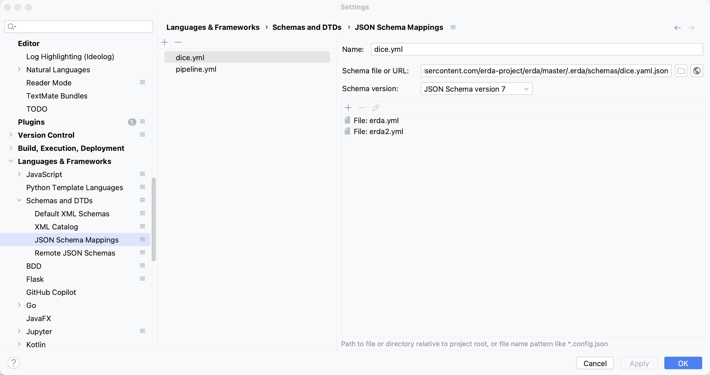
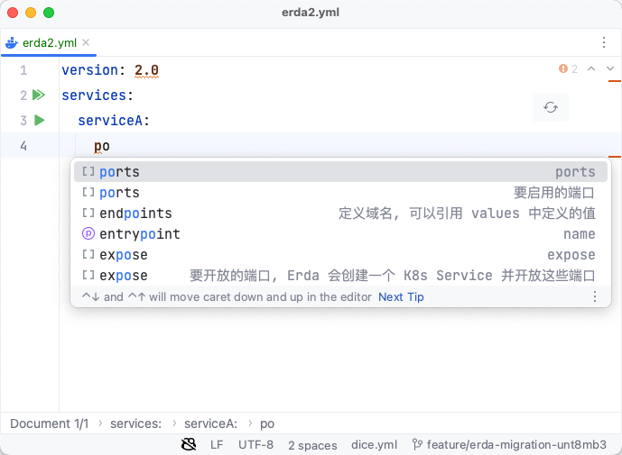

# dice.yml

dice.yml 文件采用 YAML 语法编写，是一个微服务应用部署的描述文件，由服务基本信息和服务编排关系两部分组成，包含微服务的 Docker 镜像、资源需求（CPU 和 Memory 等）、微服务之间的依赖关系、环境变量以及 Addon 等信息。

一个复杂的微服务应用仅需编写一个有效的 dice.yml 描述文件，即可由 Erda 一键部署和编排。

## 全局结构

```yaml
version: "2.0"

values:
  development: {}
  test: {}
  staging: {}
  production: {}
  
envs: {}

services: {}

addons: {}
```

dice.yml 文件的全局结构定义了 5 项全局配置，具体说明如下。

### version

version 的值目前定义为 2.0，仅需配置为 `version: "2.0"` 即可。

### values

values 用于设置不同环境中的变量，从而在一份 dice.yml 文件中维护各个环境下的配置，其格式为：

```yaml
values:
  workspace:
    key: value
```

引用 values  的变量方式为 `${key: default_value}`。

示例如下：

```yaml
values:
  development:
    cpu: 0.5
  test:
    cpu: 0.5
  staging: {}
  production:
    cpu: 2

services:
  serviceA:
    resources:
      cpu: ${cpu:1}
```

以上示例中，通过 `cpu` 配置服务在不同环境下所需的 CPU 值。

services.serviceA.resources.cpu 的值 ${cpu:1} 引用了该变量，则部署至开发环境和测试环境时，CPU 的值为 0.5；部署至预发环境时，CPU 为默认值 1；部署至生产环境时，CPU 的值为 2。

### envs

envs 定义环境变量，分为全局定义和 service 内定义，此处展示的全局结构为全局定义，通过 envs 配置全局定义的环境变量将应用至所有 services。

若全局环境变量和 service 内环境变量重复，则以 service 内环境变量为准，即 service 内环境变量可覆盖全局环境变量。

示例如下：

```yaml
envs:
  Debug: true
  Host: erda.terminus.io
  Key: value
```


### services

services 定义一组具体的 service 集合，即整个应用需编排部署的所有服务，包含微服务名、resources、deployments、ports 和 envs。

示例如下：

```yaml
services:
  # serviceA 是自定义的服务 A 的名字，不是 dice.yml 的配置项。
  serviceA:
    resources:
      cpu: 0.1
      mem: 256
    deployments:
      replicas: 2
      labels:
        GROUP: erda
    ports:
      - port: 9093
    envs:
      ADDON_PLATFORM_ADDR: addon

  # serviceB 是自定义的服务 B 的名字，不是 dice.yml 的配置项。
  serviceB:
    ...
```


### addons

addons 指在应用内能够被所有微服务依赖使用的基础服务，也被称为微服务的插件服务。addons 包括但不限于 MySQL、Kafka、Elasticsearch、Redis 等基础软件服务，用户自行研发的微服务也可沉淀为 addon，根据定义的规则发布至服务市场。

示例如下：

```yaml
addons:
  # mysql 是自定义的 Add-On 实例名字
  mysql:
    plan: mysql:basic
    options:
      version: 5.7.23
      # create_dbs 是在MySQL实例上需要创建一个或者多个逻辑库名称
      create_dbs: blog,user
  # zk 也是一个自定义的 AddOn 实例名字
  zk:
    plan: zookeeper:basic
```

## 配置项

dice.yml 内置一套配置项用于定义整个微服务应用，这些配置项是编写 dice.yml 的基础。配置项分为全局配置项、service 配置项、addon 配置项。

### 全局配置项

- version
- values 
- envs
- services
- addons

具体请参见 [全局结构](#全局结构)。

### values 配置项

values 配置项即 development、testing、staging 以及 production 四个 workspace 名称，分别代表开发环境、测试环境、预发环境和生产环境。

### service 配置项

service 配置项即微服务部署具体内容配置。

#### image
配置 service 的 Docker 镜像名称，默认为空。该配置字段为选填项，采用 CI 部署时若未填写，将直接通过服务名获取镜像。

示例如下：

```yaml
image: nginx:latest
```

#### cmd
配置 service 的启动命令，默认为空。若未配置 cmd，将启动 docker image 中定义的进程。

示例如下：

```yaml
cmd: echo hello && npm run start
```

#### ports
配置 service 监听的端口，可设置多个端口。对于需暴露给外部用户访问的端口，设置 expose 为 true。若未指定 expose，如需暴露外部使用，则默认取第一个端口。

示例如下：

```yaml
ports:
  - port: 1234
    expose: false
  - port: 4321
    expose: true
```

#### envs
配置 service 的环境变量。若与全局 envs 定义的环境变量重复时将覆盖全局配置，优先使用 service 内配置。

示例如下：

```yaml
envs:
  Debug: false
  Key: value
```

#### hosts
配置 service 的 `/etc/hosts` 绑定。

示例如下：

```yaml
hosts:
  - 127.0.0.1 www.erda.local
  - 127.0.0.1 erda.local
```

#### resources
配置 service 所需要的资源，包括 CPU、内存和磁盘。resources 包含如下子配置项：

* **cpu**：配置 CPU 核数，不足一核时可配置为小数，必填项，无默认值。

* **mem**：配置内存大小，单位为 MB，必填项。

* **disk**：配置磁盘大小，单位为 MB。

* **network**：配置容器网络，选填项，`mode` 可配置为 `overlay` 或 `host`， 默认为 `overlay`。

示例如下：

```yaml
resources:
  cpu: 1
  mem: 256
  disk: 1024
  network:
    mode: overlay
```

#### capabilities
配置 service 的 linux capabilities，`man 7 capabilities` 可查看全部可用的 linux capabilities。

* **cap_add**：添加 capability。

* **cap_drop**：删除 capability。

示例如下：

```yaml
cap_add:
  - ALL

cap_drop:
  - NET_ADMIN
  - SYS_ADMIN
```

#### deployments
配置 service 的部署策略，当前支持配置实例数、labels 等，可配置项如下：

* **mode**：部署模式可指定为 `global` 或 `replicated`。`global` 表示每个集群节点部署一个容器实例，`replicated` 表示部署指定数量的容器实例，与 replicas 选项配合使用，默认为 `replicated`。

* **replicas**：定义服务需部署的实例数量，仅在 mode 为 `replicated` 时配置，若 mode 为 `global` 则无需配置。

示例一：

```yaml
deployments:
  mode: replicated
  replicas: 2
```

示例二：

```yaml
deployments:
  mode: global
```


#### depends_on
配置 service 的部署依赖服务。

示例如下：

```yaml
# 例子表示此服务依赖于 serviceB 和 serviceC 两个服务
depends_on:
  - serviceB
  - serviceC
```

#### volumes
volumes 为容器目录提供持久化存储功能，可同时指定多个配置。

* **storage**：当前仅支持 NFS。
* **path**：指定容器内部挂载路径，需使用绝对路径。

示例如下：

```yaml
volumes:
- storage: nfs
  path: /container/data
```

#### health_check
配置 service 的健康检查机制。健康检查有两种接口可供使用，分别是 HTTP 和 Command。配置 health_check 时只可选择其一，两者无法同时使用。

HTTP 健康检查即向一个 HTTP 接口发送 GET 请求，通过查看响应的状态码是否为 200 来判断服务的健康状态。

示例如下：

```yaml
health_check:
  http:
    # port 配置健康检查 http get 请求的端口，此端口应该是 ports 配置中的一个
    port: 8080
    # path 配置健康检查 http get 的 URI 路径
    path: /health
    # duration 设定健康检查需要持续的检查的时间，单位是秒；这个时间值应该设置为比服务启动需要的时间更长一点
    duration: 120
```

Command 健康检查即运行一个指定命令，通过查看命令执行的退出码是否为 0 来判断服务的健康状态。

示例如下：

```yaml
health_check:
  exec:
    # cmd 配置要运行的命令，此处的 curl 只是一个例子，你可以写任何想要的命令
    cmd: curl http://127.0.0.1:8080/health
    # duration 同 http 健康检查
    duration: 120
```

#### k8s_snippet
配置 service 对 Kubernetes manifest 的 Patch 片段，目前支持 Container 层级的片段。

示例如下：

修改服务镜像的拉取策略由默认的 `IfNotPresent` 更改为 `Always`。

```yaml
k8s_snippet:
  container:
    imagePullPolicy: Always
```

### addon 配置项

addon 配置项用于描述一个具体的 addon 对象，包含 addon 的类型、规格以及附加参数等信息。

示例如下：

```yaml
addons:
  mysql:                 # mysql 是自定义的 Add-on 实例名字
    plan: mysql:basic    # plan：表示规格
    options:             # options：附加参数，如版本
      version: 5.7.23
      # create_dbs 是在MySQL实例上需要创建一个或者多个逻辑库名称
      create_dbs: blog,user
```

#### 名称

平台通过名称实现共享策略。用户自定义名称后，在相同项目环境下，可通过该名称自动共享 addon。但在开发和测试环境中，该名称将被自动忽略，直接修改为 addon 自身的名称。

#### plan
plan 用于描述 addon 的类型和规范，格式如下：

plan：{addon类型}:{规格}

其规格由具体的 addon 决定，通常有 basic、professional 和 ultimate 三类。

示例如下：

```yaml
# 这是一个 basic 规格的 mysql addon
plan: mysql:basic
```

#### options
options 定义 addon 的附加参数。

示例如下：

```yaml
options:
  version: 5.7.23
  create_dbs: blog,blog2
```

## 变量引用
### 平台级变量
在 dice.yml 的 `.services[serviceName].endpoints[i].domain` 字段值中，可引用平台级变量，引用语法为 `${platform.Key}`。

目前支持的平台级变量有 `platform.DICE_PROJECT_NAME`。

示例如下：
```yaml
version: "2.0"
services:
  user-center:
    endpoints:
    - domain: hello-${platform.DICE_PROJECT_NAME}.*
```

### values 变量
在 dice.yml 的 `.values` 字段中为各环境配置键值对，可在所有字段的值中进行引用。

### envs 变量
环境变量的值之间可引用其他环境变量的值，引用语法为 `${env.Key}`。

示例如下：
```yaml
version: "2.0"

envs:
  PROJECT_APP: ${env.DICE_PROJECT_NAME}/${env.DICE_APPLICATION_NAME} // 引用平台定义的环境变量
  DOMAIN: ${env.PROJECT_APP}.my-site.com // 引用别处定义的环境变量
```

:::tip 提示

开发者可在 dice.yml 的服务级和全局、部署配置、Addon 等场景配置环境变量，变量之间可互相引用（但不允许出现循环引用）。

开发者可引用自定义的环境变量，也可引用平台定义的环境变量。

:::

## 示例

```yaml
version: "2.0"

# values 并不是必须的, 但如果你要为某些参数在不同环境下配置不同的值, 它将很有用
values:
  development:
    cpu: 0.5
  test:
    cpu: 0.5
  staging: {}
  production:
    cpu: 2
    mem: 1024

# 全局环境并不是必须的
envs:
  DEBUG: true
  TERMINUS_TRACE_ENABLE: false

services:
  # showcase-front 是一个 service 的名字，你需要根据自己的服务在这里填写正确的名字
  showcase-front:
    image: nginx:latest
    cmd: echo hello && npm run start
    ports:
      - port: 8080
	    expose: true
    # service 内的 envs 用于定义服务私有的环境变量，可以覆盖全局环境变量中的定义。
    envs:
      TERMINUS_TRACE_ENABLE: false
      TERMINUS_APP_NAME: showcase-front-app
    hosts:
      - 127.0.0.1 www.terminus.io
    resources:
      cpu: ${cpu:1}   # 在开发环境和测试环境 cpu=0.5; 在预发环境 cpu=1; 在生产环境, cpu=2
      mem: ${mem:256} # 在生产环境, mem=1.24; 在其他环境, mem=256, 即默认值
      disk: 100
	  network:
	    mode: container
    deployments:
      # replicas 不能小于 1，replicas 定义了服务需要被部署几个容器实例。
      replicas: 2
    depends_on:
      - blog-servic
    volumes:
    - storage: nfs
      path: /container/data
    health_check:
        http:
          port: 8080
          path: /health
          duration: 120

  # blog-service 示范了最简洁的服务配置，也就是只配置了最必须的配置项。
  blog-service:
    image: nginx:latest
    resources:
      cpu: 0.2
      mem: 256
      disk: 100
    deployments:
      replicas: 3

addons:
  mysql:
    plan: mysql:basic
    as: MYSQL
    options:
      version: 5.7.23
      create_dbs: blog,blog2
  zk:
    plan: zookeeper:professional
```

# 集成开发环境配置
## IntelliJ 家族产品(以 IntelliJ IDEA 为例)

> `Settings` -> `Language & Frameworks` -> `Schema and DTDs` -> `JSON Schema Mappings`



在列表栏创建 JSON Schema Mapping，在右侧栏 `Name` 为该 Mapping 命名(推荐为 `dice.yml`)，`Schema file or URL` 填写 `https://raw.githubusercontent.com/erda-project/erda/master/.erda/schemas/dice.yaml.json`，即 dice.yml JSON Schema 路径。在文件列表添加要应用该 JSON Schema 的文件，一般为 `dice.yml` 或 `erda.yml`，请根据实际路径填写。

按以上说明配置后，在 IDEA 中编写 dice.yml 就可以获得 IDEA 补全、语法提示、高亮、语法检查等功能了。



## VS Code

在 VS Code 设置文件VS添加如下配置：

```json
{
    "json.schemas": [
        {
            "fileMatch": [
                "erda.yml",
                "dice.yml"
            ],
            "url": "https://raw.githubusercontent.com/erda-project/erda/master/.erda/schemas/dice.yaml.json"
        }
    ]
}
```